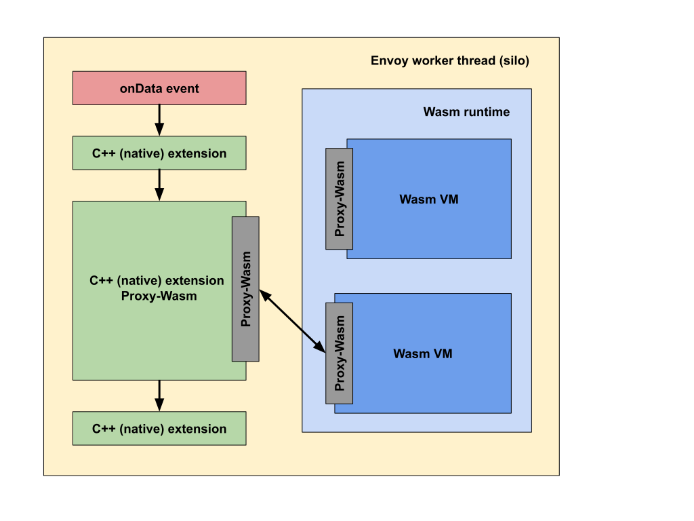

# WebAssembly in Envoy

## Background

As of early 2019, Envoy is a statically compiled binary, with all its extensions compiled at
build-time. This means that projects that provide custom extensions (e.g. Istio), must maintain and
distribute their own binaries, instead of using the official and unmodified Envoy binary.

For projects that don’t control their deployment, this is even more problematic, because any updates
and/or bug fixes to extensions require building new binary, producing release, distributing it, and
more importantly, re-deploying it in production.

This also means that there is often a version drift between deployed extensions and the control
plane configuring them.

## Solution

While parts of the issue could be solved using dynamically loadable C++ extensions, this isn’t
feasible solution at this time, because, due to the rapid pace of Envoy development, there is no
stable ABI, or even API, for the extensions, and more often than not, updating Envoy requires code
changes, which makes updating a manual process.

Instead, we’ve decided to address this problem by writing and delivering Envoy extensions in
WebAssembly with stable ABI, since it brings many additional benefits (described below).

## What is WebAssembly?

WebAssembly (Wasm) is an up-and-coming portable binary format for executable code.  The code is
executed at a nearly-native speed in a memory-safe (for host) sandbox, with clearly defined resource
constraints, and an API for communicating with the embedding host environment (i.e. proxy).

## Benefits

* **Agility**. Extensions can be delivered and reloaded at runtime, directly from the control plane.
  This means not only that everybody can use the official and unmodified version of a proxy to load
  custom extensions, but also that any bug fixes and/or updates can be pushed and/or tested at
  runtime, without the need to update and/or re-deploy a new binary.

* **Reliability and Isolation**. Because extensions are deployed inside a sandbox with resource
  constraints, they can crash and/or leak memory, without bringing the whole proxy down.
  Furthermore, CPU and memory usage can be limited.

* **Security**. Because extensions are deployed inside a sandbox with clearly defined API for
  communicating with a proxy, they have access and can modify only a limited number of properties of
  the connection and/or request. Furthermore, because proxy mediates this interaction, it can hide
  or sanitize sensitive information from the extension (e.g. “Authorization” and “Cookie” HTTP
  headers, or client’s IP address).

* **Diversity**. Over 30 programming languages can be compiled to WebAssembly modules, allowing
  developers from all backgrounds (C, Go, Rust, Java, TypeScript, etc.) to write Proxy-Wasm
  extensions in their language of choice.

* **Maintainability**. Thanks to the fact that extensions are written using standard libraries,
  independent from proxy’s codebase, we can provide a stable ABI.

* **Portability**. Because the interface between host environment and extensions is proxy-agnostic,
  extensions written using Proxy-Wasm can be executed in various proxies, e.g. Envoy, NGINX, ATS or
  even inside the gRPC library (assuming they all implement the standard).

## Drawbacks

* Higher memory usage, due to the need to start many virtual machines, each with its own memory
  block.

* Lower performance for extensions transcoding the payload, due to the need to copy significant
  amounts of data in and out of the sandbox.

* Lower performance for CPU-bound extensions. The slowdown is expected to be less than 2x, compared
  to the native code.

* Increased binary size, due to the need to include Wasm runtime. It’s ~20MB for WAVM and ~10MB for
  V8.

* The WebAssembly ecosystem is still young, and the development is currently focused on the
  in-browser usage, where JavaScript is considered to be the host environment.

## High-level overview

With Proxy-Wasm, developers can write proxy extensions using their programming language of choice,
ideally using language-specific libraries provided by us. Those extensions are then compiled to
portable Wasm modules, and distributed in that format.

On the proxy side, once a Wasm module is loaded (either directly from disk or pushed from the
control plane over xDS), it’s validated for conformance with the defined Proxy-Wasm interface and
instantiated using the embedded Wasm runtime, which creates a new Wasm virtual machine in each
worker thread.

For each of Envoy’s extension types, we’ve created a shim that translates the extension’s interface
to Proxy-Wasm calls, so the interfaces are very similar to those used in native (C++) Envoy
extensions, embracing the event-driven programming model.

## Runtimes

In order to execute provided Proxy-Wasm extension, proxy needs to embed a Wasm runtime, which will
execute the code in a sandbox. Currently, there are two C or C++ Wasm runtimes: LLVM-based WAVM, and
V8. For the time being, both WAVM and V8 are embedded in Envoy, and we can select one or the other
in the configuration, but we’re most likely going to upstream solution with only one runtime.

## Virtual machines

When the Wasm runtime instantiates a Wasm module, it creates a Wasm virtual machine (VM instance)
for it.

There are a few models for mapping between VM instances and Proxy-Wasm extensions. Ultimately, it’s
a trade-off between: startup latency & resource usage, and isolation & security.

* **Persistent in-process VM per worker thread per Wasm module (shared across multiple configured
  uses of Wasm extension)**.
  A single Wasm module can contain multiple extensions (e.g. listener filter and transport socket,
  both in a single package). For each Wasm module, a single persistent in-process VM instance is
  created, and it can (but doesn’t have to) be shared by all Proxy-Wasm extensions referencing that
  Wasm module in the configuration.

* **Persistent in-process VM per worker thread per Wasm extension**.
  A single persistent in-process VM instance is created for each Wasm extension and it’s shared by
  all Proxy-Wasm extensions referencing the given Wasm module in the configuration, similarly to how
  the native (C++) extensions are instantiated today.

* **Persistent in-process VM per worker thread per configured use of Wasm extension**.
  A single persistent in-process VM instance is created for each configured use of a Proxy-Wasm
  extension referencing given Wasm module in the configuration. This model provides stronger
  isolation guarantees than the previous models, and it should be preferred in the multi-tenant
  environments.

* **Ephemeral (per request) in-process VM**.
  A new ephemeral in-process VM instance is created for each request, for each Proxy-Wasm extension,
  and it’s destroyed immediately after the request is finished. This is expected to be prohibitively
  expensive.

* **Out-of-process VM**.
  This is out of scope for this document, but for deployments loading untrusted (and potentially
  malicious) Wasm modules in multi-tenant environments, that require strong security guarantees and
  want to protect against Spectre-like attacks, proxy should communicate with an out-of-process Wasm
  sandbox (e.g. using Filters-over-gRPC or shared memory) that implements Proxy-Wasm, which would
  execute Wasm modules on its behalf and stream results back to the proxy.

## Host environment

Sandboxed Wasm VMs communicate with the embedding host environment (i.e. proxy) using clearly
defined interfaces, that include: functions exported from the Wasm module, which proxy can invoke,
helper functions which Wasm VM can invoke, and Wasm functions for memory management.

Because this interface is very low-level and fairly stable, it allows us to define a stable ABI
(function prototypes to be defined in a separate document), which the extensions can use.

## Supported languages and APIs

Proxy-Wasm extensions can be written in any language targeting WebAssembly, but because those
extensions need to adhere to the aforementioned interface, we’re going to provide libraries for a
few selected languages (C/C++ using Emscripten, Rust, Go and TypeScript), to speed up the
development of those extensions.

While in theory any Wasm module conforming to the ABI, regardless of which language it was written
in, should work out-of-the-box, the Wasm ecosystem is still very young and lacks standards,
especially for non-Web environments, and some languages have assumptions and/or requirements
regarding the host environment they are executed in, e.g. Go-compiled Wasm modules use syscall/js,
and expect the host environment to be JavaScript.

## Control Plane (xDS) integration

Proxy-Wasm extensions can be loaded by referencing them in the configuration using Envoy’s
Config::DataSource, which can either point to a file on disk or contain inlined Wasm module sent
from the control plane (xDS). We’re extending this interface to support fetching resources from the
HTTP servers as well.  Since the loaded Wasm module is going to be executed, stronger checks, like
SHA256 checksum, or digital signature of extensions are highly recommended.

## Fault detection and notification

In case of crashing Wasm VM (e.g. because of bugs in the Wasm extension), proxy should create a new
instance of the VM, log the information about the crash, and expose it to the external systems (e.g.
using stats), so that control plane can act upon this information.

Ideally, proxy should also track the number of crashes, and upon reaching a limit, it should stop
restarting Wasm VM (to prevent entering the crash-loop), and start rejecting connections and/or
returning errors to clients.

## Configurable resource constraints

Each configured Proxy-Wasm extension can set resource constraints (maximum memory each VM can
allocate, and maximum CPU time it can consume during each invocation) in order to limit resource
usage.

## Configurable API restrictions

The list of available APIs can be limited for each configured Proxy-Wasm extension, so that
compute-only extensions (e.g. compression) won’t have access to APIs that they don’t need (e.g.
HTTP/gRPC sidecalls).

Furthermore, some of the APIs can sanitize inputs and/or outputs (e.g. removing returned header
values, or restricting list of hosts that the HTTP/gRPC sidecalls can be made to).

## Ecosystem (“Proxy-Wasm extensions Store”)

To be finalized once this takes-off and gains adoption in the community.
